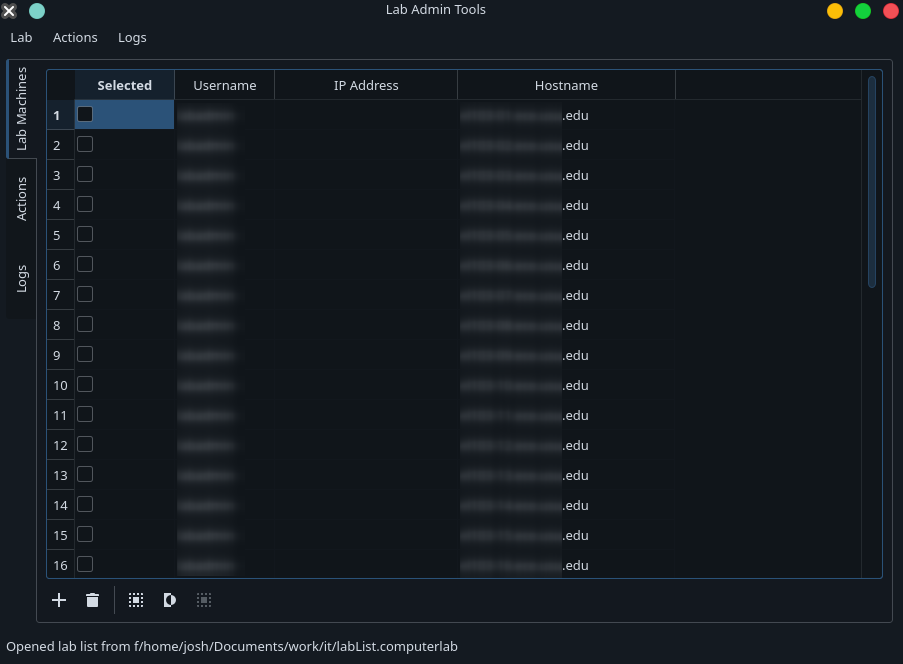
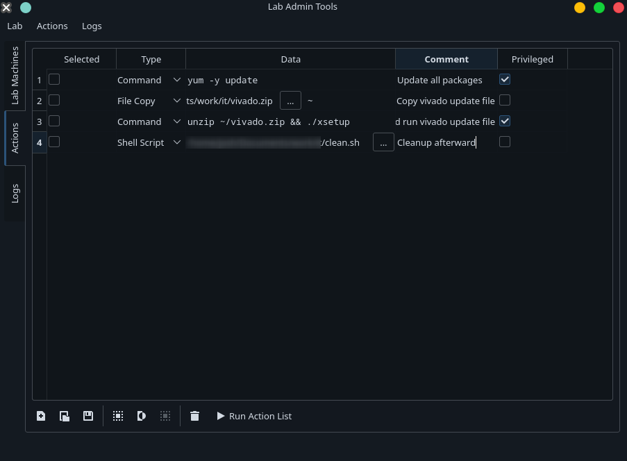
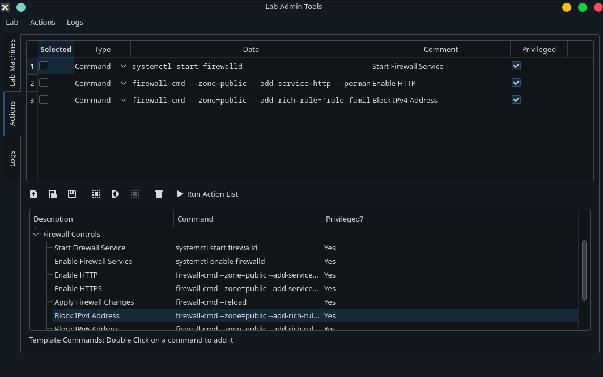
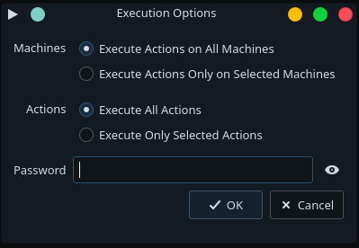
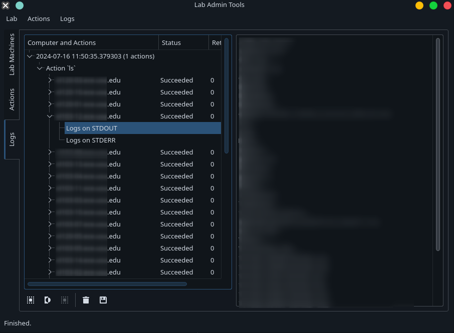

# Lab Admin Tools

A graphical tool that makes use of `fabric` to execute commands, copy files, and administer networks of computers.

**Status**: Usable, but in &alpha; (unstable)

This tool is written using Python, PyQt5, and `fabric`. It lets you store lists of "actions" to be executed on a "lab", a.k.a., a set of computers. These actions are executed all at once, on every computer in the lab, by making use of fabric's `ThreadedGroup` class. The following action types are supported:

1. Command: Write a one-line command to be executed on each machine
2. File copy: copy a file to the target machines
3. Script: execute an entire shell script on each machine

Action lists can also be exported as UNIX shell scripts, so this tool may be used to graphically build administrative scripts that can be run later without the tool itself.

## Features

- Save/Load target computer lists (Labs)
- Save/Load action lists
- Save logs (output from commands)
    + Logs show exit code, connection issues, etc
- Export action list as POSIX Shell script
- Template actions (common stuff that sysadmins would use frequency)

## Planned Features

(roughly in the order of how soon they will be implemented

- [ ] Packaged executable file downloads (the pyinstaller GitHub action is currently not working)
- [ ] Cryptographic key authentication
- [ ] Machine-wise authentication overrides
- [ ] User-modifiable template actions

## Before running

Make sure to use `rcc` or `pyrcc5` to create a `resources.py` in the `src` directory from `resources.qrc`.

```bash
pyrcc5 resources.qrc >> src/resources.py
```

## Screenshots

Note: UI uses default OS styling. These screenshots were taken on KDE plasma with global dark mode enabled. Some details were blurred for privacy/security.











## FAQ

Q: Do I need to install this software on each target machine?

A: No. You just need SSH, preferably OpenSSH.

Q: The UI freezes when a long command is running. Why?

A: A separate thread dispatches commands, but blocks too much, which may cause the UI to appear laggy and slow. We're working on that.

Q: Doesn't Ansible already do this? Why make this?

A: Yes, Ansible has basically all and more functionality than this tool. The goal of this tool is to have a low barrier to entry; its GUI is designed for users which are not familiar with a CLI or config files, which Ansible requires users to be familiar with.

Q: Do you support Windows target machines?

A: Yes. As long as they are running OpenSSH.
